# UCS757-Emotion Detection in Audio Files (Speech & Songs)

Built deep learning model that detects 8 different kind of emotions - neutral, calm, happy, sad, angry, fearful, disgust and surprised in any user uploaded audio file.
Web Application developed using Django.

## Table of contents
* [Behind the Project](#Behind-the-Project)
* [Metrics](#metrics)
* [Methodology Flow Chart](#methodology-flow-chart)
* [I/O Screenshots](#inputoutput-screenshots)
* [Tools & Technologies Used](#technologies-and-tools)
* [Setup](#setup)
* [How to Use this Repo](#how-to-use-this-repo)
* [Developer stuff](#developer-stuff)
* [Status](#status)
* [Appendix](#appendix)

## Behind the Project

This project is a Django-REST API that uses a deep learning model interfacing using a simple front end. The model adopted in this work is an Emotion Classifier trained with audio files of the RAVDESS & TESS dataset links to which are in the Appendix.

This project presents a deep learning classifier able to detect the emotions of a human speaker encoded in an audio file. The classifier is trained using 2 different datasets, RAVDESS and TESS, and has an overall F1 score of 80% on 8 classes (neutral, calm, happy, sad, angry, fearful, disgust and surprised).

Feature set information -

For this task, the dataset is built using 5252 samples from:
* the Ryerson Audio-Visual Database of Emotional Speech and Song (RAVDESS) dataset
* the Toronto emotional speech set (TESS) dataset

The samples include:
1440 speech files and 1012 Song files from RAVDESS. This dataset includes recordings of 24 professional actors (12 female, 12 male), vocalizing two lexically-matched statements in a neutral North American accent. Speech includes calm, happy, sad, angry, fearful, surprise, and disgust expressions, and song contains calm, happy, sad, angry, and fearful emotions. Each file was rated 10 times on emotional validity, intensity, and genuineness. Ratings were provided by 247 individuals who were characteristic of untrained adult research participants from North America. A further set of 72 participants provided test-retest data. High levels of emotional validity, interrater reliability, and test-retest intrarater reliability were reported.

2800 files from TESS. A set of 200 target words were spoken in the carrier phrase "Say the word _____' by two actresses (aged 26 and 64 years) and recordings were made of the set portraying each of seven emotions (anger, disgust, fear, happiness, pleasant surprise, sadness, and neutral). There are 2800 stimuli in total. Two actresses were recruited from the Toronto area. Both actresses speak English as their first language, are university educated, and have musical training. Audiometric testing indicated that both actresses have thresholds within the normal range.

The classes the model wants to detect are as follows: (0 = neutral, 1 = calm, 2 = happy, 3 = sad, 4 = angry, 5 = fearful, 6 = disgust, 7 = surprised). This dataset is skewed as there is not a calm class in TESS, hence there are less data for that particular class and this is evident when observing the classification report.

**Detection/Prediction Accuracy of 0.80** 

More information on datasets in the appendix.

## Metrics 

*Model summary*

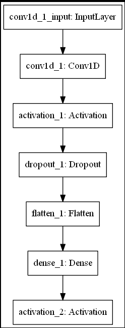 

*Loss and accuracy plots*

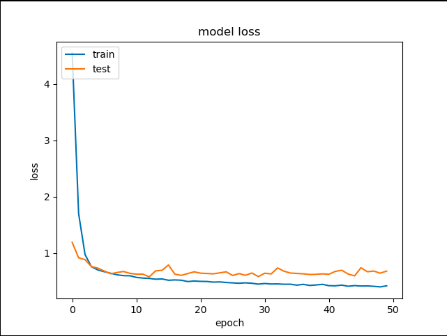 

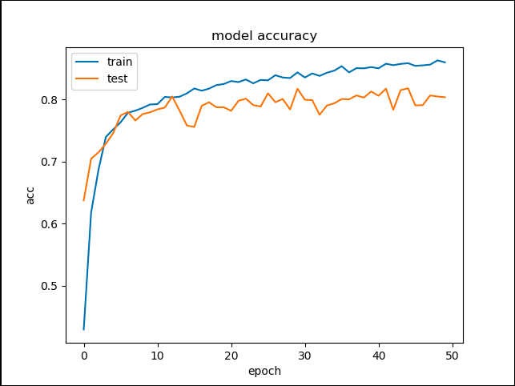

*Classification report*

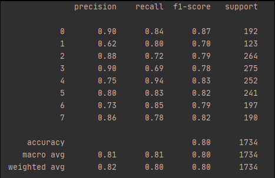

*Confusion matrix*

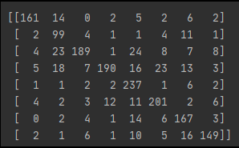

## Methodology Flow Chart


## Input/Output Screenshots

**User Journey**

The user journey starts on the index page at ```/index/``` where it is possible to choose if 

1) Upload a new file on the server;
2) Delete a file from the server;
3) Detect emotion of a file uploaded on the server;

*Landing Page*

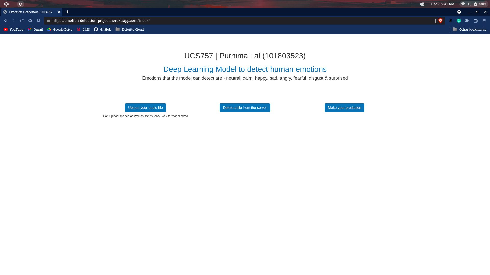

Choosing ```Upload your audio file``` the user will be redirected to a modified home page. The user will be asked to pick a file from his computer. The UI will confirm if the operation has been successful. 

*Upload File*

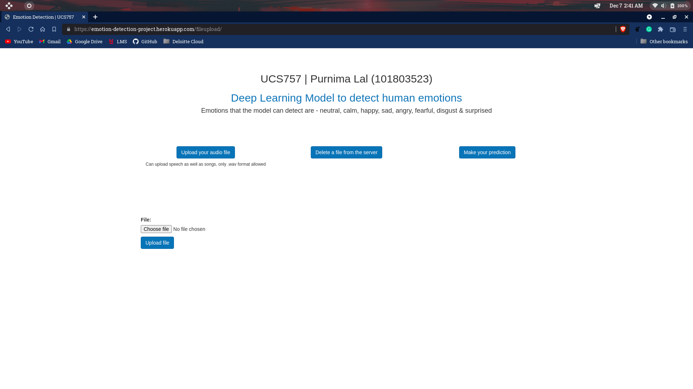
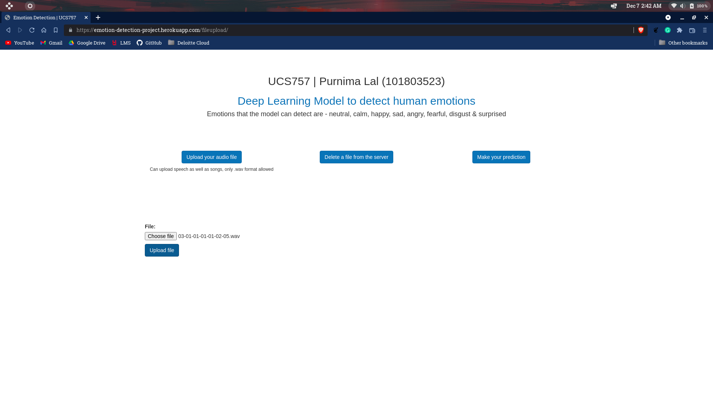
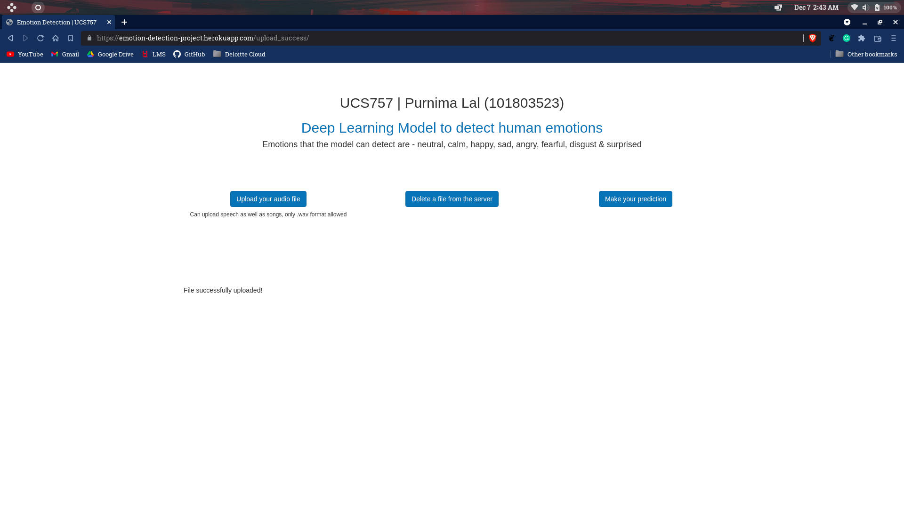

*Delete File*
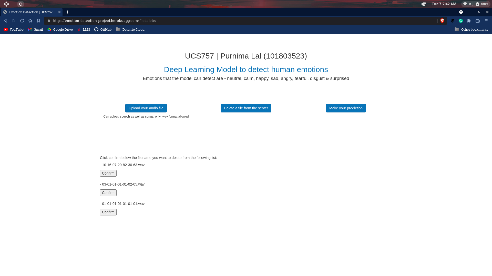
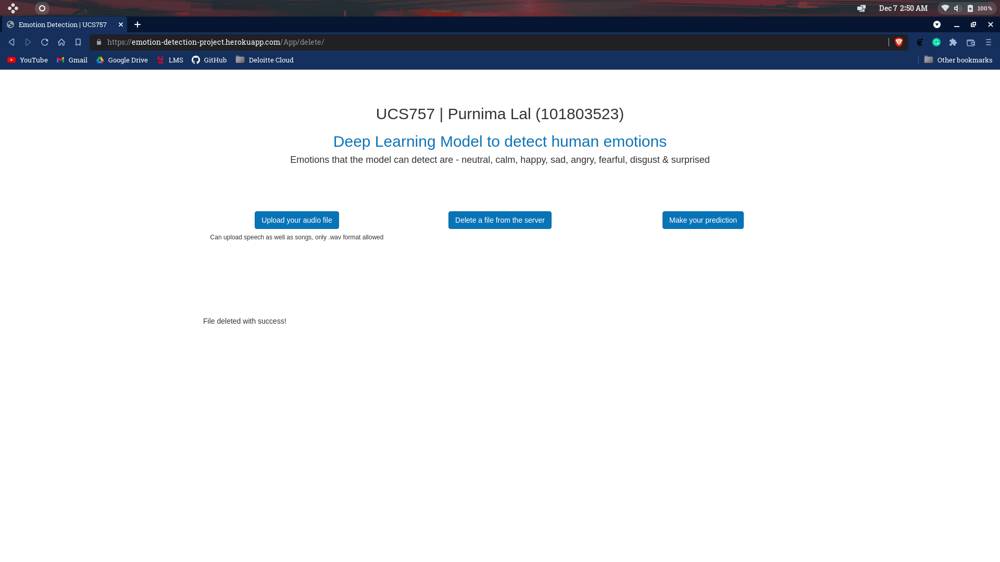

*Detect Emotion*

Choosing ```Detect Emotion``` the user will be redirected to a modified home page. On this page, it will be possible to see a list of the files already on the server. Following the path ```media/{filename}``` it will be also possible to listen to the audio file.


After clicking on ```Submit```, the user will be redirected to a modified home page that will include the emotion detected by the Keras model for the file selected.


*Another sample file*


**See the App in action!**

The current version of the application is deployed on Heroku: https://emotion-detection-project.herokuapp.com/index/ . 

## Technologies and Tools
* Python 3.x 
* TensorFlow
* Keras
* OpenCV
* h5py

## Setup

* Use the command prompt to setup a virtual environment.
* Install all dependencies and requirements using the following command - 

`python -m pip install -r requirements.txt`

This will install all libraries required for the project.

## How to Use this Repo 

### Run via the Django App
* Clone the repo by running - 

    `git clone https://github.com/purnima99/UCS757-EmotionDetection.git`

* Run the manage.py file - 
    
    `python manage.py runserver`

# Developer stuff

**DB creation**

PostgreSQL needs to be installed. Helpful link - https://phoenixnap.com/kb/how-to-install-postgresql-on-ubuntu

After the installation of PostgreSQL, it is possible to use pgAdmin to create a ```django-emotion-classification``` database and a ```App_filemodel``` table.

The ```App_filemodel``` table can be created with the following script:

```
CREATE DATABASE django_emotion_classification;

CREATE USER purnima WITH PASSWORD 'test';

CREATE TABLE App_filemodel (
   id INT PRIMARY KEY NOT NULL,
   file TEXT NOT NULL,
   timestamp DATE NOT NULL,
   path TEXT NOT NULL
);

GRANT SELECT, INSERT, UPDATE, DELETE ON ALL TABLES IN SCHEMA django_emotion_classification TO purnima;

ALTER USER purnima CREATEDB; -- This is to run the automatic tests, otherwise you will get an "unable to create database" error when running python manage.py test

```

Please note the above script is made with the data available in the ```settings.py```, but it is possible to change it if needed.
```
DATABASES = {
    'default': {
        'ENGINE': 'django.db.backends.postgresql_psycopg2',
        'NAME': 'django_emotion_classification',
        'USER': 'purnima',
        'PASSWORD': 'test',
        'HOST': 'localhost',
        'PORT': '',
        'OPTIONS': {'sslmode': 'disable'},
    }
}
```
Another helpful link - https://dev.to/prisma/how-to-setup-a-free-postgresql-database-on-heroku-1dc1

## Status    
Project Status: Completed 

## Appendix

**The RAVDESS dataset**

*Download*

The Ryerson Audio-Visual Database of Emotional Speech and Song (RAVDESS) can be downloaded free of charge at https://zenodo.org/record/1188976. 

*Construction and Validation*

Construction and validation of the RAVDESS is described in our paper: Livingstone SR, Russo FA (2018) The Ryerson Audio-Visual Database of Emotional Speech and Song (RAVDESS): A dynamic, multimodal set of facial and vocal expressions in North American English. PLoS ONE 13(5): e0196391. https://doi.org/10.1371/journal.pone.0196391.

The RAVDESS contains 7356 files. Each file was rated 10 times on emotional validity, intensity, and genuineness. Ratings were provided by 247 individuals who were characteristic of untrained adult research participants from North America. A further set of 72 participants provided test-retest data. High levels of emotional validity, interrater reliability, and test-retest intrarater reliability were reported. Validation data is open-access.

**Description**

The dataset contains the complete set of 7356 RAVDESS files (total size: 24.8 GB). Each of the 24 actors consists of three modality formats: Audio-only (16bit, 48kHz .wav), Audio-Video (720p H.264, AAC 48kHz, .mp4), and Video-only (no sound).  Note, there are no song files for Actor_18.

**License information**

“The Ryerson Audio-Visual Database of Emotional Speech and Song (RAVDESS)” by Livingstone & Russo is licensed under CC BY-NA-SC 4.0.

*File naming convention*

Each of the 7356 RAVDESS files has a unique filename. The filename consists of a 7-part numerical identifier (e.g., 02-01-06-01-02-01-12.mp4). These identifiers define the stimulus characteristics:

Filename identifiers 

- Modality (01 = full-AV, 02 = video-only, 03 = audio-only).
- Vocal channel (01 = speech, 02 = song).
- Emotion (01 = neutral, 02 = calm, 03 = happy, 04 = sad, 05 = angry, 06 = fearful, 07 = disgust, 08 = surprised).
- Emotional intensity (01 = normal, 02 = strong). NOTE: There is no strong intensity for the ‘neutral’ emotion.
- Statement (01 = “Kids are talking by the door”, 02 = “Dogs are sitting by the door”).
- Repetition (01 = 1st repetition, 02 = 2nd repetition).
- Actor (01 to 24. Odd numbered actors are male, even numbered actors are female).

*Filename example: 02-01-06-01-02-01-12.mp4*

- Video-only (02)
- Speech (01)
- Fearful (06)
- Normal intensity (01)
- Statement “dogs” (02)
- 1st Repetition (01)
- 12th Actor (12)
- Female, as the actor ID number is even.

**The TESS dataset**

Pichora-Fuller, M. Kathleen; Dupuis, Kate, 2020, "Toronto emotional speech set (TESS)", https://doi.org/10.5683/SP2/E8H2MF, Scholars Portal Dataverse, V1

